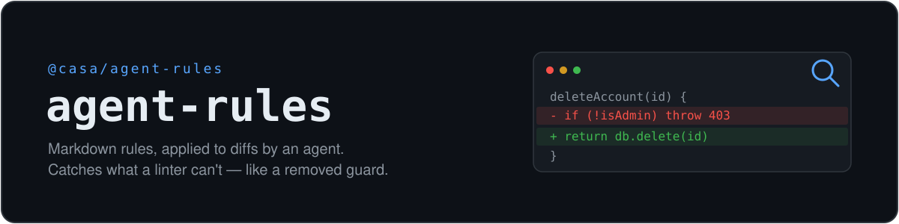

<p align="center">
  
</p>

# Agent Rules

Apply Markdown-defined coding rules to a diff using an LLM.

Rules are plain Markdown files with YAML front-matter. Each rule declares the file
globs it cares about; at review time the tool discovers the rules that apply to a
diff, asks a model to check each one against its scoped changes, and returns
findings anchored to specific lines.

The package is **LLM-agnostic** (you supply an adapter, or the CLI delegates to a
local agent like `claude`/`codex`) and **platform-agnostic** (it returns findings;
you decide how to surface them). It ships as a library (`runReview`, `getDiff`, and
the building blocks) and a CLI (`agent-rules`).

## Why not just a linter?

A linter only ever sees the code as it exists now, so it's the right tool for
pattern-matchable facts about the current tree (unused vars, formatting, `console.log`).

agent-rules reviews the **diff** — including removed lines — and reasons about the
_change_. That makes it suited to things a linter structurally can't catch:

- **Removals** — a deleted authorization check or `try`/`catch` is invisible in the
  final code; only the diff shows it. (See `examples/rules/`.)
- **Intent and contracts** — breaking a shared type, dropping a test, semantic review.

Write rules for the change; keep your linter for the snapshot.

## Install

```sh
yarn add @casa/agent-rules
```

Requires Node ≥22. Pure ESM.

## Rule files

Put rules under a directory (e.g. `.agent/rules/`), one per file (`.md` or `.mdc`):

```markdown
---
description: No console.log
globs:
  - 'src/**/*.ts'
  - '!src/**/*.test.ts'
---

Use the project logger instead of `console.log` in non-test source files.
```

| Field         | Description                                                                   |
| ------------- | ----------------------------------------------------------------------------- |
| `description` | Display name (falls back to the filename)                                     |
| `globs`       | Inline list or YAML list; `!` negates. A rule with no globs is never applied. |
| `reviewSkip`  | If `true`, the rule is parsed but excluded from review                        |

## CLI

The CLI delegates to a local agent CLI for model access — no API key needed. It
resolves a transport in order: `--exec` → `--transport <claude|codex>` →
the launching agent (e.g. `$CLAUDE_CODE_EXECPATH`) → `claude`/`codex` on `PATH`.
If none is found it fails (exit 2).

```sh
# Review uncommitted changes against the default rules dir (.agent/rules)
agent-rules --working-tree

# Review a range, emit JSON
agent-rules --diff origin/main...HEAD --output json

# Pin a specific installed agent
agent-rules --working-tree --transport codex

# Force an explicit transport command (any stdin->stdout program)
agent-rules --working-tree --exec "claude -p --output-format json"
```

Diff sources (exactly one): `--working-tree`, `--staged`, `--diff <range>`.
Run `agent-rules --help` for all options. Exit codes: `0` clean, `1` blocking
findings, `2` error.

## Library

```ts
import { runReview, getDiff, type LLMAdapter } from '@casa/agent-rules';

const llm: LLMAdapter = {
  async run(prompt) {
    // call any model and return its text response
    return await myModel(prompt);
  },
};

const diff = await getDiff({ type: 'range', range: 'origin/main...HEAD' });

const result = await runReview({
  rulesDir: '.agent/rules',
  diff,
  llm,
  minSuggestionImpact: 7, // default
  concurrency: 3, // default
});

for (const f of result.findings) {
  console.log(`${f.path}:${f.line} [${f.severity}] ${f.body}`);
}
```

`runReview` owns no timeout/retry policy — that belongs to your `LLMAdapter`. A
rejected `run` drops that one rule into `result.skipped` instead of aborting the run.

## Agent integration (slash command)

Add a `/agent-rules` slash command to Claude Code or Codex. The command runs
`agent-rules --list` to fetch the rules that apply to your current changes, then
the agent you're already talking to reviews the diff against them. `--list` only
**discovers** rules — it doesn't call a model — so there's no nested agent, no
extra cost, and no separate auth.

Templates live in [`examples/integrations/`](./examples/integrations/).

**Claude Code** — copy the command into your project (or `~/.claude/commands/` for all projects):

```sh
mkdir -p .claude/commands
cp node_modules/@casa/agent-rules/examples/integrations/claude-code/agent-rules.md .claude/commands/
# (or copy from this repo if you're not installing the package)
```

**Codex** — copy the prompt into your Codex prompts directory:

```sh
mkdir -p ~/.codex/prompts
cp node_modules/@casa/agent-rules/examples/integrations/codex/agent-rules.md ~/.codex/prompts/
```

Then run `/agent-rules` in a session. It reviews your working-tree changes against
the rules in `.agent/rules`. Edit the copied command to change the rules directory
or the diff source (e.g. `--staged`).

## Transport notes (CLI)

The CLI delegates to a local agent in headless mode, so the agent must be usable
non-interactively:

- **claude** must be logged in (`claude /login`). A spawned `claude -p` that isn't
  authenticated surfaces as a per-rule error in `skipped`.
- **codex** is invoked with `--skip-git-repo-check` and a read-only sandbox, and
  authenticates the same way as your interactive `codex`.

If neither resolves (and no `--exec` is given), the CLI exits 2 with guidance.

## Development

```sh
yarn install
yarn build            # compile to dist/ (pure ESM + .d.ts)
yarn typecheck
yarn test             # 36 unit tests (hermetic)
yarn smoke            # end-to-end CLI test via a fake transport (hermetic, CI-safe)
yarn verify:transport # live check against a real claude/codex (manual, makes a model call)
```

## License

MIT
